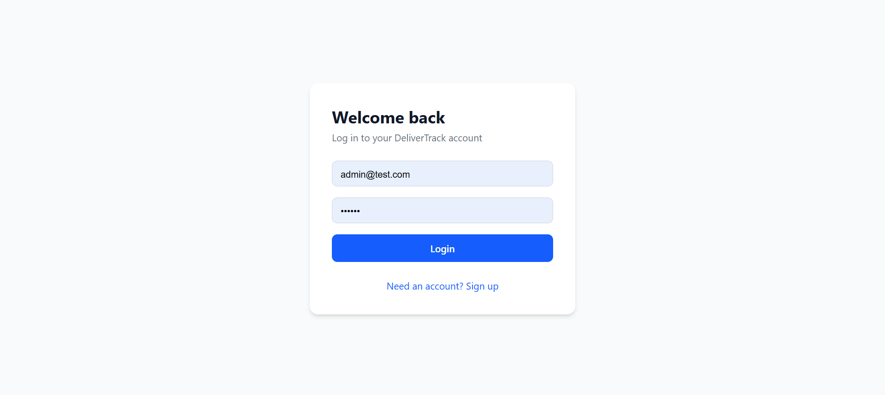
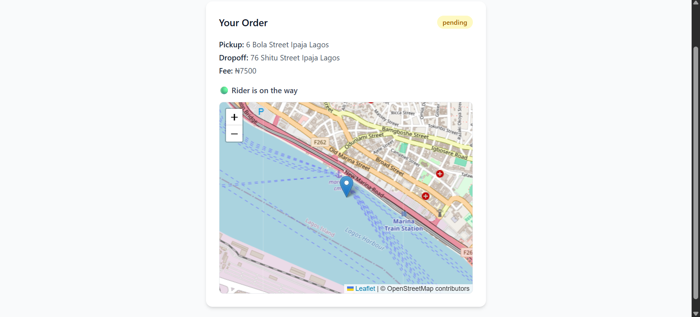
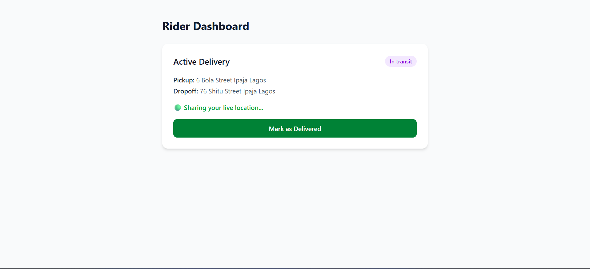
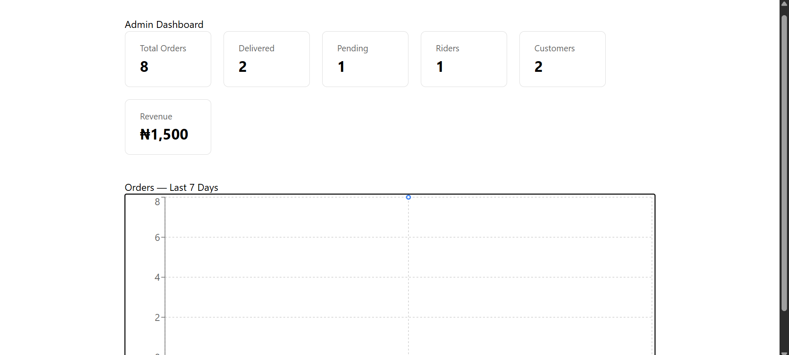

# DeliverTrack

A real-time last-mile delivery tracking platform built for the Nigerian market — customers create delivery orders, riders accept and share live GPS location, and admins monitor everything from an analytics dashboard.

## Screenshots

### Login



### Customer — Live Order Tracking



### Rider — Pending & Active Orders



### Admin Dashboard



## Live Demo

[Live URL here once deployed]

## Tech Stack

- **Frontend:** React (Vite), Tailwind CSS, React Router, Leaflet / React-Leaflet, Recharts, Axios, Socket.io-client
- **Backend:** Node.js, Express, MongoDB (Mongoose), Socket.io, JWT, bcryptjs
- **Payments:** Paystack API
- **Deployment:** Vercel (frontend), Render (backend), MongoDB Atlas

## Key Features

- **Role-based authentication** — JWT-secured signup/login with three roles: customer, rider, admin
- **Real-time GPS tracking** — riders share live location via the browser's Geolocation API, broadcast through Socket.io, and rendered on a live-updating Leaflet map for the customer
- **Order lifecycle management** — create → pending pool → rider acceptance → in transit → delivered
- **Paystack payment integration** — delivery fee payment with server-side transaction verification
- **Admin analytics dashboard** — order volume, revenue, and a 7-day order trend chart built with Recharts

## What This Project Demonstrates

- Building and securing a real-time system with Socket.io, including room-based broadcasting and JWT-authenticated socket connections
- Integrating a third-party payment gateway end-to-end (initialize → checkout → server-side verification)
- Designing role-based access control across both REST endpoints and frontend routes
- Working with live device data (Geolocation API) and rendering it on an interactive map
- Full-stack ownership: data modeling, API design, real-time infrastructure, and UI — all built and deployed independently

## Getting Started Locally

### Prerequisites

- Node.js installed
- A MongoDB Atlas cluster (or local MongoDB instance)
- A Paystack test account (for payment testing)

### 1. Clone the repository

```bash
git clone https://github.com/Mikesticks4tech/delivery-tracker.git
cd delivery-tracker
```

### 2. Set up the backend

```bash
cd server
npm install
```

Create a `.env` file in `server/` with:

```
PORT=5000
MONGO_URI=your_mongodb_connection_string
JWT_SECRET=your_jwt_secret
PAYSTACK_SECRET_KEY=your_paystack_test_secret_key
```

Run the server:

```bash
node server.js
```

### 3. Set up the frontend

```bash
cd ../client
npm install
npm run dev
```

The app will be available at `http://localhost:5173`.

## Author

Built by [Idowu Michael (Mikesticks4tech)](https://github.com/Mikesticks4tech)
